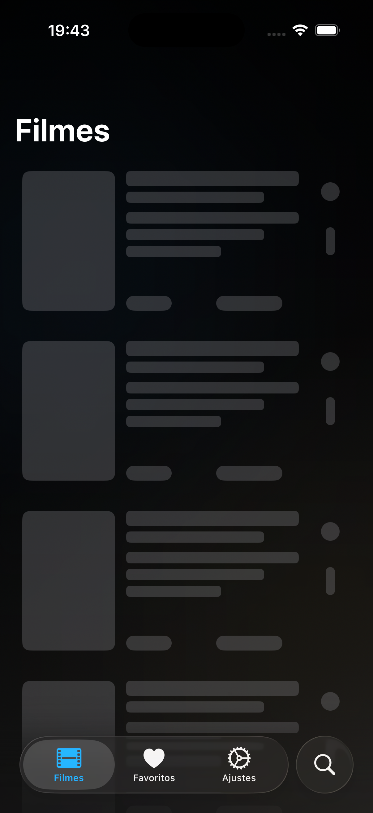
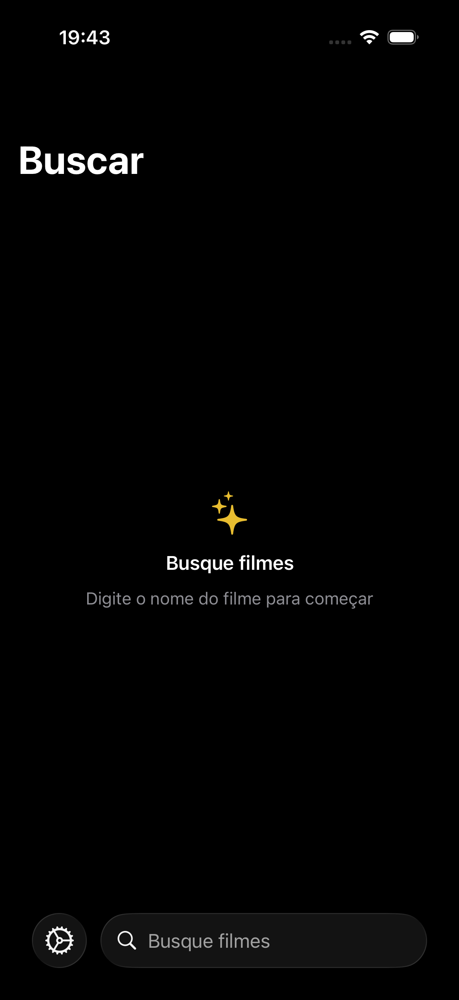

# GhibliApp iOS

## Visao Geral
- Aplicativo SwiftUI que cataloga os filmes e entidades do universo Studio Ghibli.
- Arquitetura MVVM em camadas, com separacao clara entre apresentacao, dominio, dados e infraestrutura.
- Offline-first desde o dia zero: cache local, fila de alteracoes e monitoramento ativo de conectividade.
- Configuravel via `AppConfiguration.plist`, que define a base da API publica do Studio Ghibli.

## Stack Tecnica
- Swift 6, SwiftUI e Combine na camada de apresentacao.
- Concurrency moderna (actors, `async/await`, tipos `Sendable`).
- SwiftData como persistencia primaria via `SwiftDataAdapter` (com `UserDefaultsAdapter` opcional).
- CloudKit integrado opcionalmente via `CloudKitSyncAdapter` (mantido inerte por falta de conta Apple paga; basta ativar o flag quando o upgrade estiver disponivel).

## Arquitetura e Camadas
- **Presentation (MVVM)**: views SwiftUI em `Presentation/` consomem view models que orquestram casos de uso e mantem um `ViewState` declarativo.
- **Domain**: `Domain/` concentra modelos imutaveis e casos de uso (`UseCases/`) que encapsulam regras de negocio (ex.: `FetchFilmsUseCase`, `ToggleFavoriteUseCase`).
- **Data**: `Data/` implementa repositorios concretos, DTOs e adaptadores HTTP. Cada repositorio recebe um `StorageAdapter` (cache) e um `HTTPClient` para interagir com a API remota.
- **Infrastructure**: `Infrastructure/` abriga configuracao, DI (`AppContainer`), conectividade, log, persistencia e mecanismos de sincronizacao.
- **Utils/Resources**: extensoes compartilhadas, constantes e configuracoes (plist, assets, LaunchScreen).

## Arquitetura: Clean Architecture + MVVM

Este projeto combina *Clean Architecture* (organização em camadas) com *MVVM* aplicado apenas na camada de apresentação. Importante lembrar:

> MVVM não é arquitetura de sistema; Clean Architecture (ou layered architecture) é. MVVM é um padrão local usado para estruturar a UI.

Visão geral (camadas)

```
┌───────────────┐
│ Presentation  │  ← SwiftUI + ViewModels (MVVM)
└───────▲───────┘
  │
┌───────┴───────┐
│    Domain     │  ← Regras de negócio
└───────▲───────┘
  │
┌───────┴───────┐
│     Data      │  ← Repositórios e fontes de dados
└───────▲───────┘
  │
┌───────┴───────┐
│ Infrastructure│  ← Implementações técnicas
└───────────────┘
```

Regra fundamental: dependências sempre apontam para dentro (camadas externas dependem de abstrações das internas).

Presentation (MVVM)

- Responsável apenas por exibir estado e reagir a eventos de UI.
- Contém: `View` (SwiftUI), `ViewModel`, `ViewState` (structs imutáveis) e mapeamentos simples domínio → UI.
- Não contém: regras de negócio, lógica de sincronização ou acesso direto a storage/rede.

Papel do MVVM aqui

- `View`: declarativa e sem lógica de negócio.
- `ViewModel`: orquestra casos de uso, expõe estado observável e recebe dependências por injeção (nunca cria casos de uso internamente).

Domain

- Coração do sistema: modelos de domínio imutáveis, casos de uso (`UseCases`) e protocolos de repositório.
- Não depende de SwiftUI, SwiftData ou CloudKit — altamente testável.

Data

- Implementa contratos do `Domain`: repositórios concretos, DTOs, mapeadores e lógica de cache (read-through / write-through).
- Decide quando usar cache ou chamar API e normaliza dados antes de salvar.

Infrastructure

- Camada mais externa: adaptadores concretos (`SwiftDataAdapter`, `UserDefaultsAdapter`, `CloudKitSyncAdapter`), `ConnectivityMonitor`, `AppContainer` (DI), feature flags, etc.
- Conhece frameworks e é facilmente substituível sem impactar `Domain` ou `Presentation`.

Onde o Offline‑First entra nessa arquitetura

- Estratégia transversal: cache e persistência em `Data`, fila e sincronização em `Infrastructure`, contratos em `Domain`.
- Fluxo típico:

```
UI → ViewModel → UseCase → Repository → StorageAdapter → PendingChangeStore → SyncManager (quando aplicável)
```

Sync e MVVM: separação intencional

- O sistema de sincronização não vive no MVVM. `ViewModels` não disparam sync nem sabem se ele está ativo; o `SyncManager` reage à conectividade.
- Isso evita efeitos colaterais na UI, estados inconsistentes e `ViewModels` inchados.

Resumo

O projeto utiliza Clean Architecture para organizar responsabilidades e MVVM exclusivamente na camada de apresentação. `ViewModels` orquestram `UseCases` do `Domain` sem conhecer detalhes de persistência, rede ou sincronização — garantindo um app offline-first, testável e preparado para evolução futura.

### Fluxo MVVM (resumo)
1. Uma view (ex.: `FilmsView`) injeta o view model via `AppContainer`.
2. O view model dispara casos de uso do dominio.
3. Cada caso de uso conversa com um repositorio do modulo `Data`.
4. Os repositorios coordenam chamadas HTTP/cache e retornam modelos de dominio para a UI.

## API e Endpoints
- **Base**: `https://ghibliapi.vercel.app` (configuravel em `Resources/AppConfiguration.plist`).
- **Padrao**: todos os endpoints usam `GET` com codificacao URL.

| Entidade | Endpoint | Descricao |
| --- | --- | --- |
| Filmes | `/films` e `/films/{id}` | Listagem e detalhe de filmes |
| Pessoas | `/people` | Personagens |
| Locais | `/locations` | Locais iconicos |
| Especies | `/species` | Especies representadas |
| Veiculos | `/vehicles` | Veiculos e maquinas |

A camada `Data/Network/Endpoints` define enums para cada recurso (ex.: `FilmEndpoint`) e os `EndpointRequestFactory` + `URLSessionAdapter` convertem essas declaracoes em requisicoes `URLRequest`.

## Offline-first
- **StorageAdapter**: protocolo que abstrai persistencia. O padrao atual e `SwiftDataAdapter.shared`; `UserDefaultsAdapter` pode ser alternado sem impacto nos repositorios.
- **Cache de dados**: repositorios salvam respostas normalizadas para garantir leitura instantanea e consistente mesmo sem rede.
- **Fila de alteracoes**: `PendingChange` + `PendingChangeStore` (actor) registram toda acao mutavel (ex.: favoritos) com timestamp e metadados da entidade.
- **SyncManager**: observa `ConnectivityRepositoryProtocol` (implementado por `ConnectivityMonitor`) e, ao detectar reconexao, delega o reprocessamento das pendencias via `PendingChangeSyncStrategy`.
- **Estrategias de sync**:
  - `NoopPendingChangeSyncStrategy`: padrao de producao; preserva a fila ate existir backend de escrita.
  - `MockPendingChangeSyncStrategy`: usada em DEBUG para simular sucesso, parcial ou falha, permitindo validacao ponta a ponta.
  - `CloudKitSyncAdapter`: esqueleto pronto para sincronizar via CloudKit quando `FeatureFlags.syncEnabled` for ativado (atualmente desligado por limitacao da conta gratuita Apple).
- **Favoritos offline**: `FavoritesRepository` grava favoritos localmente e adiciona uma `PendingChange` com a acao (`add`/`remove`). Mesmo sem rede, o estado e refletido imediatamente na UI.

### Estado atual do Sync
Por padrao, o sincronismo remoto esta **desativado** (`FeatureFlags.syncEnabled = false`).
O app opera 100% offline-first, preservando a fila de alteracoes localmente. Quando houver backend de escrita (ou CloudKit habilitado), basta ativar o flag e fornecer uma `PendingChangeSyncStrategy` concreta.

### Modelo de dados
Atualmente nao ha conceito de usuario autenticado. Todas as alteracoes (como favoritos) sao locais ao dispositivo. O design permite introduzir identidade de usuario futuramente sem refatoracao estrutural.

### Fora de escopo (por design)
- Autenticacao
- Escrita remota
- Resolucao de conflitos
- Sincronizacao em background

### Diagrama textual
```
UI → ViewModel → UseCase → Repository
       ↓
     StorageAdapter
       ↓
 PendingChangeStore → SyncManager → SyncStrategy
```

## Configuracao de Build
1. Instale as dependencias padrao do Xcode (nenhum gerenciador adicional e necessario).
2. Abra `GhibliApp.xcodeproj` ou execute via CLI:
  ```sh
  xcodebuild -scheme GhibliApp -destination 'platform=iOS Simulator,name=iPhone 17' clean build
  ```
3. Execute a aplicacao no simulador desejado.

## Testes
- `GhibliAppTests/` e `GhibliAppUITests/` fornecem a base para cenarios unitarios e de UI.
- Testes adicionais podem ser introduzidos futuramente para `PendingChangeStore`, `FavoritesRepository` e casos de uso criticos, conforme evolucao do sync.

Sinta-se a vontade para abrir issues ou PRs com melhorias, especialmente em torno da estrategia de sincronizacao e cobertura de testes.

## Documentação e capturas

Há uma pasta de apoio com recursos visuais em `Docs/Screenshots/` contendo prints do app que ajudam no onboarding e revisão de UI. Arquivos atuais:

- `Docs/Screenshots/loadingFilms.png` — estado de carregamento
- `Docs/Screenshots/films.png` — lista de filmes
- `Docs/Screenshots/filmDetail.png` — tela de detalhe do filme
- `Docs/Screenshots/favorites.png` — tela de favoritos
- `Docs/Screenshots/settings.png` — configuracoes
- `Docs/Screenshots/search.png` — busca

Sinta-se à vontade para renomear ou reorganizar esses arquivos; eu já movi as imagens para `Docs/Screenshots/` e atualizei os links abaixo para caminhos relativos dentro do repositório.

### Sequência visual (fluxo de uso)
Abaixo a sequência das telas principais — carregamento → lista → detalhe → favoritos → busca → configurações.

 ➡️  ➡️  ➡️  ➡️  ➡️ 

Os caminhos foram atualizados para `Docs/Screenshots/<nome>.png` (case-sensitive). Se preferir outro padrão de nomecnclatura, me diga e eu ajusto.
